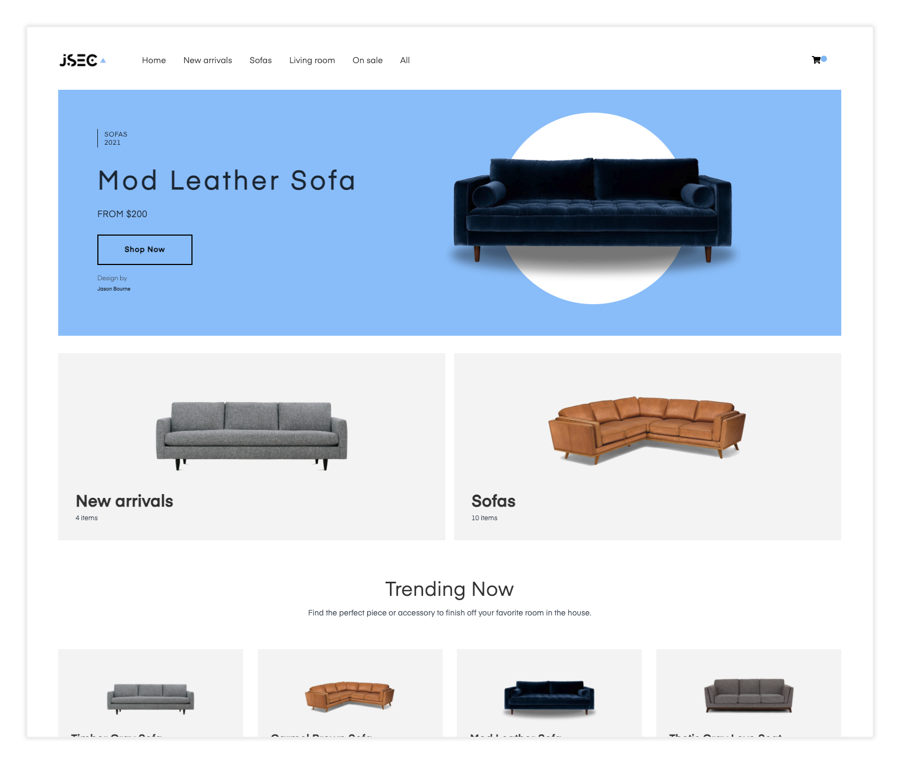
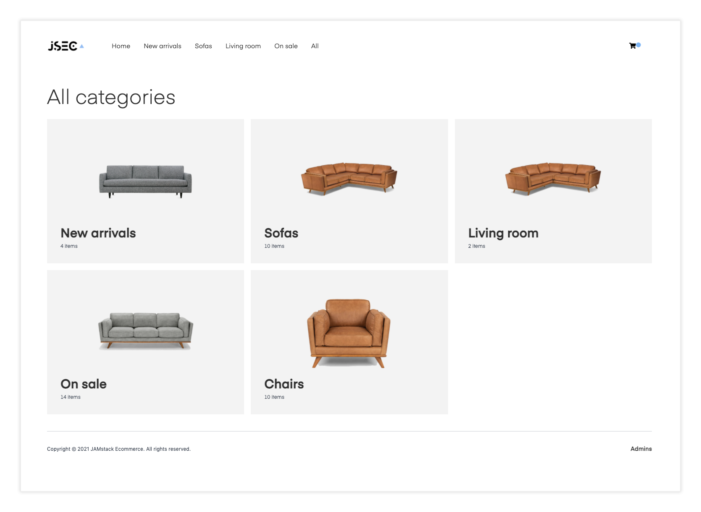
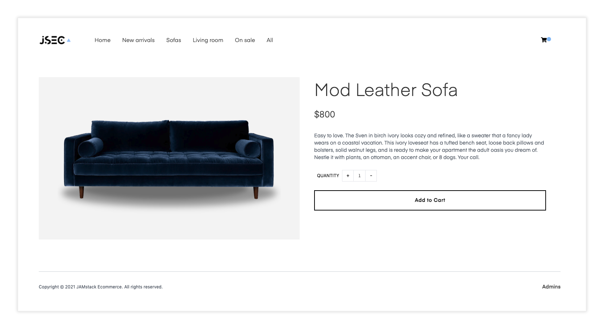
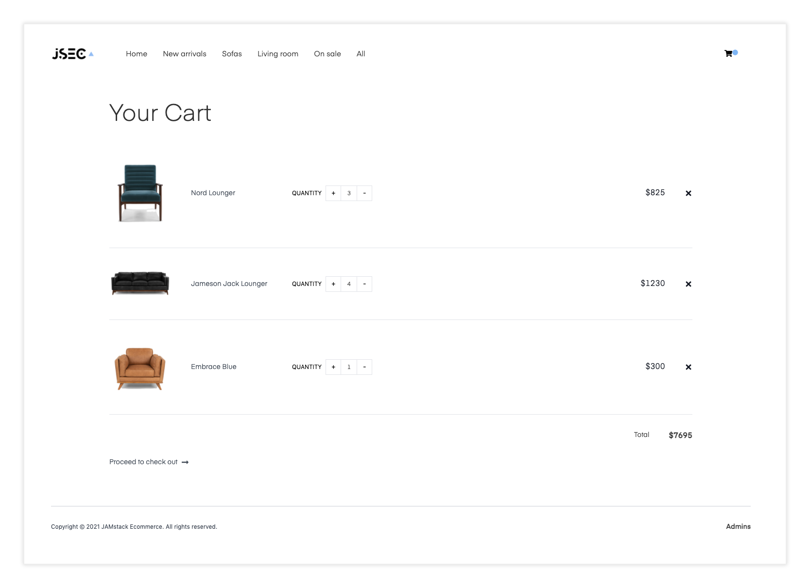
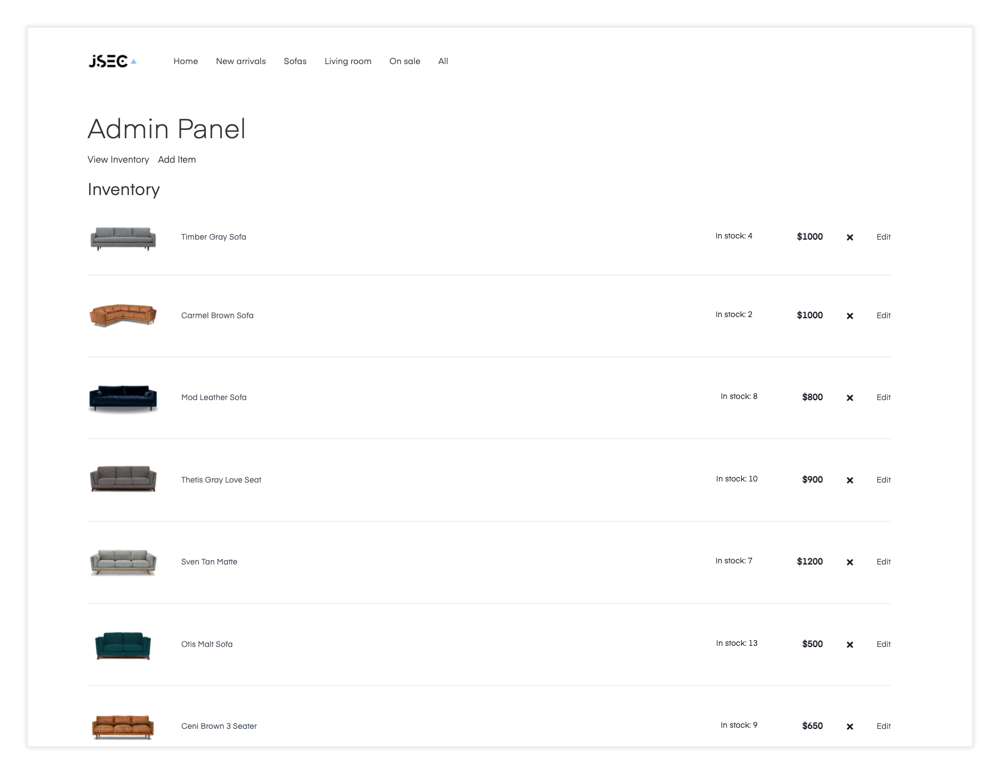

## JSEC Sofas

An online sofa store built with Next.js and PostgreSQL: a live catalogue with search, filters and
reviews, real stock tracking, Stripe checkout, order history, and an admin panel for products and orders.



### Live preview

Click [here](https://www.jamstackecommerce.dev/) to see a live preview.

<details>
  <summary>Other Jamstack ECommerce pages</summary>

### Category view


### Item view


### Cart view


### Admin panel

</details>

### Getting started

Requires Node.js (any recent version) and npm. The project runs on Next.js 10, so the npm scripts
start it under Node 16 automatically via `npx` (downloaded once on first run).

1. Get the code onto the machine (clone your own repo, or copy the folder without `node_modules`).

2. Install the dependencies (`.npmrc` already sets `legacy-peer-deps`):

```sh
npm install
```

3. Create your local settings file. It is git-ignored, so every machine needs its own:

```sh
cp .env.example .env.local
```

Then fill in `.env.local`:

| Variable | What to put |
|---|---|
| `JWT_SECRET` | A long random string, e.g. the output of `openssl rand -hex 32` |
| `NEXT_PUBLIC_STRIPE_PUBLISHABLE_KEY` | Your Stripe `pk_test_...` key ([dashboard](https://dashboard.stripe.com/test/apikeys)) |
| `STRIPE_SECRET_KEY` | Your Stripe `sk_test_...` key |
| `ADMIN_EMAILS` | Comma-separated emails of accounts that can open `/admin` |
| `DATABASE_URL` | Postgres connection string, e.g. `postgres://localhost:5432/jsec_sofas` |

4. Set up the database (needs PostgreSQL 13+ running, e.g. `brew install postgresql@16 && brew services start postgresql@16`):

```sh
npm run db:setup   # creates the database, applies db/migrations, loads the starter sofas
```

`npm run db:migrate` applies new migrations; `npm run db:seed` re-runs the seed (it never overwrites
existing products, so admin edits are safe). The seed also imports any accounts and orders from the
old `data/users.json` / `data/orders.json` files.

5. Run the project:

```sh
npm run dev      # http://localhost:3000
```

Sign up at `/signup` with an email listed in `ADMIN_EMAILS` to get access to the admin panel.
Test card: `4242 4242 4242 4242`, any future expiry, any CVC.

### What's in the database

| Table | Holds |
|---|---|
| `users` | Customer accounts (bcrypt password hashes) |
| `products`, `categories`, `product_categories` | The catalogue: price, sale price, stock, material, colour, seats, dimensions |
| `orders`, `order_items` | Orders with a copy of each item's name and price at the time of purchase |
| `reviews` | One star rating and review per customer per sofa |
| `images` | Product photos uploaded from the admin panel, served at `/api/images/<id>` |

**Stock** is taken when an order is placed (inside a transaction, so two shoppers can't buy the last
sofa) and given back if the payment fails or an admin cancels the order. Cancelling a paid order in
the admin panel refunds it through Stripe.

**Order lifecycle:** `pending` (waiting for 3D Secure) → `paid` → `shipped` → `delivered`, or `cancelled`.

## Deploy to Vercel

Use the [Vercel CLI](https://vercel.com/download)

```sh
vercel
```

## Deploy to AWS

```sh
npx serverless
```

## About the project

### Tailwind

This project is styled using Tailwind. To learn more how this works, check out the Tailwind documentation [here](https://tailwindcss.com/docs).

### Where things live

__Database schema__ - db/migrations   
__Starter catalogue__ - db/seed-data.js   
__Server data access__ - lib (db, auth, products, orders, reviews, payments)   
__API routes__ - pages/api   
__Admin panel__ - pages/admin.js, components/admin   
__Store name__ - ecommerce.config.js   
__Logo__ - public/logo.png   

